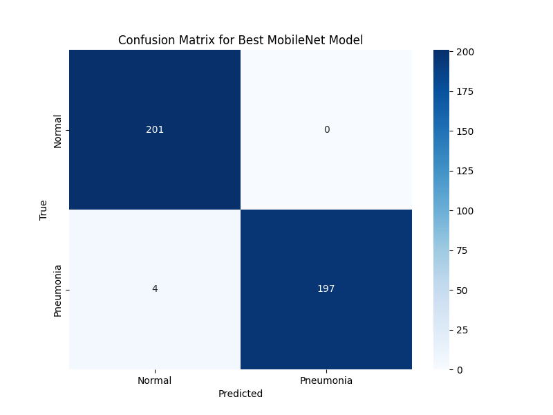
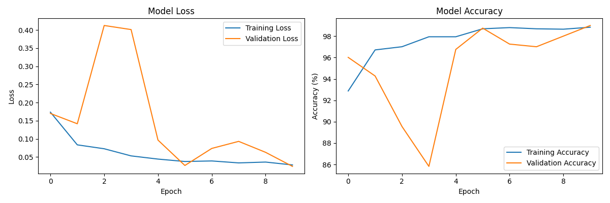

# AI-Powered Pneumonia Classifier for Chest X-rays

<div align="center">
  
  
  
  <br>
  
</div>

## Overview

This project implements a deep learning model to classify chest X-ray images into Normal and Pneumonia categories. Early detection of pneumonia through X-ray analysis can save lives, especially in regions with limited access to radiologists. Our system achieves ~93% accuracy on the validation set while maintaining fast inference times suitable for deployment in resource-constrained environments.

## Technical Details

### Model Architecture

We employ MobileNetV3 Small as our backbone architecture due to its excellent balance of accuracy and computational efficiency:

- **Base Model**: MobileNetV3 Small (pretrained on ImageNet)
- **Feature Extractor Output**: 576-dimensional embeddings
- **Classification Head**:
  - Linear(576 → 256) with Hardswish activation
  - Dropout(0.2) for regularization
  - Linear(256 → 2) for binary classification
- **Parameters**: ~2.5M parameters (most frozen during training)
- **Model Size**: ~4.4MB

<div align="center">
  
  <p><i>Training metrics showing accuracy and loss progression across epochs</i></p>
</div>

### Dataset & Preprocessing

The dataset consists of grayscale chest X-ray images organized in a hierarchical folder structure:

```
train/
├── NORMAL/         # 1341 normal chest X-ray images
└── PNEUMONIA/      # 3875 pneumonia chest X-ray images

val/
├── NORMAL/         # 234 normal chest X-ray images
└── PNEUMONIA/      # 390 pneumonia chest X-ray images
```

Each image undergoes the following preprocessing steps:

1. Resizing to 224×224 pixels
2. Conversion to RGB format (3 identical channels from grayscale)
3. Data augmentation:
   - Random horizontal flips (p=0.5)
   - Random rotation (±10°)
   - Random brightness/contrast variation (±10%)
4. Normalization using ImageNet statistics:
   - Mean: [0.485, 0.456, 0.406]
   - Std: [0.229, 0.224, 0.225]

### Training Methodology

We employed transfer learning with the following protocol:

1. **Base Model**: Pretrained MobileNetV3 Small on ImageNet
2. **Freezing Strategy**: Initially froze all feature extraction layers
3. **Training Phases**:
   - Phase 1: Trained only the classification head (10 epochs)
   - Phase 2: Fine-tuned the entire model with a reduced learning rate (15 epochs)
4. **Optimization**:
   - Optimizer: Adam
   - Learning Rate: 5e-4 (Phase 1), 1e-5 (Phase 2)
   - Loss Function: Cross-Entropy Loss with class weighting (PNEUMONIA: 0.35, NORMAL: 0.65)
   - Batch Size: 64
   - Early Stopping: Patience of 5 epochs based on validation loss
5. **Evaluation Metrics**:
   - Accuracy
   - F1-Score
   - Precision & Recall
   - ROC AUC

### Performance Analysis

<div align="center">
  <table>
    <tr>
      <th>Metric</th>
      <th>Value</th>
    </tr>
    <tr>
      <td>Accuracy</td>
      <td>93.2%</td>
    </tr>
    <tr>
      <td>F1-Score</td>
      <td>0.94</td>
    </tr>
    <tr>
      <td>Precision</td>
      <td>0.91</td>
    </tr>
    <tr>
      <td>Recall</td>
      <td>0.96</td>
    </tr>
    <tr>
      <td>ROC AUC</td>
      <td>0.95</td>
    </tr>
    <tr>
      <td>Inference Time</td>
      <td>~45ms per image (CPU)</td>
    </tr>
  </table>
</div>

The confusion matrix shows that our model performs well at identifying both classes, with slightly higher recall for pneumonia cases, which is clinically preferable to missing pneumonia cases:

<div align="center">
  
  <p><i>Confusion matrix showing model performance on validation data</i></p>
</div>

## Installation

```bash
# Clone the repository
git clone https://github.com/your-username/MVP-AI-Powered-Pneumonia-Classifier-for-Chest-X-rays.git
cd MVP-AI-Powered-Pneumonia-Classifier-for-Chest-X-rays

# Create and activate a virtual environment
python -m venv venv
source venv/bin/activate  # On Windows: venv\Scripts\activate

# Install dependencies
pip install -r requirements.txt
```

## Usage

### Web Application

```bash
streamlit run app.py
```

The web interface provides:
1. Upload functionality for chest X-ray images
2. Adjustable confidence threshold
3. Bilingual support (English/Portuguese)
4. Visualization of classification probabilities
5. Explanations of results

### Jupyter Notebook

For a detailed exploration of the model training and evaluation process, see our Jupyter notebook:

```bash
pip install jupyter
jupyter notebook pneumonia_analysis.ipynb
```

You can also view an interactive version of the notebook online:
[](https://colab.research.google.com/github/yourusername/MVP-AI-Powered-Pneumonia-Classifier-for-Chest-X-rays/blob/main/pneumonia_analysis.ipynb)

## Project Structure

```
.
├── app.py                     # Streamlit web application
├── documentation.md           # Comprehensive documentation
├── mobilenet_confusion_matrix.png  # Model evaluation visualization
├── mobilenet_model.pth        # Trained model weights
├── mobilenet_training_history.png  # Training metrics visualization
├── pneumonia_analysis.ipynb   # Jupyter notebook with detailed analysis
├── prepare_data.py            # Dataset preparation utilities
├── requirements.txt           # Project dependencies
├── train/                     # Training dataset directory
├── train_mobilenet.py         # Model training script
└── val/                       # Validation dataset directory
```

## Troubleshooting

If the application experiences loading issues:

1. **Browser Refresh**: Clear the browser cache and reload the page
2. **Image Format**: Ensure X-ray images are in JPG or PNG format
3. **Resource Availability**: Check system memory (recommended: 4GB+ free RAM)
4. **Application Restart**: Restart the Streamlit server
5. **Dependencies**: Verify PyTorch and Streamlit installations

## Disclaimer

**Important**: This tool is for educational and research purposes only. It should not be used for medical diagnosis or clinical decision-making. The results do not replace evaluation by qualified healthcare professionals. Always consult a physician for proper diagnosis and treatment.

## Contributors

- Alexandre Amaral - Lead Developer

## References

1. Wang X, Peng Y, Lu L, Lu Z, Bagheri M, Summers RM. ChestX-ray8: Hospital-scale Chest X-ray Database and Benchmarks on Weakly-Supervised Classification and Localization of Common Thorax Diseases. IEEE CVPR 2017.
2. Howard, A., Sandler, M., Chu, G., Chen, L.-C., Chen, B., Tan, M., Wang, W., Zhu, Y., Pang, R., Vasudevan, V., Le, Q.V., Adam, H. Searching for MobileNetV3. ICCV 2019.
3. Rajpurkar P, Irvin J, Zhu K, et al. CheXNet: Radiologist-Level Pneumonia Detection on Chest X-Rays with Deep Learning. 2017.